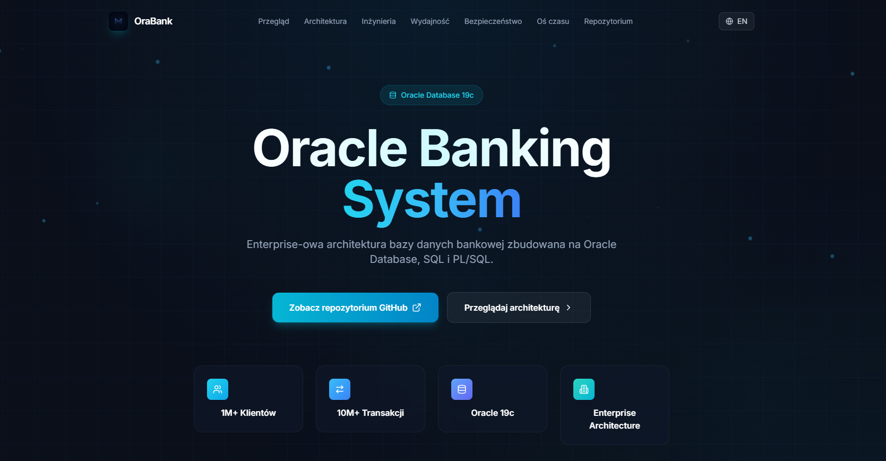
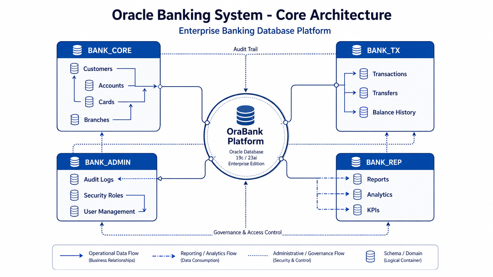
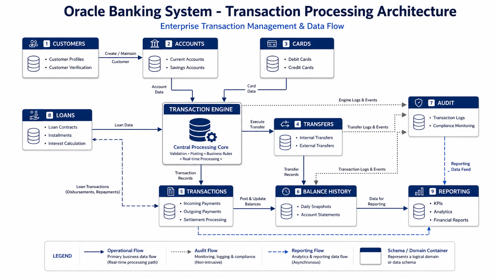

<p align="center">
  
</p>

<h1 align="center">Oracle Banking System</h1>


<p align="center">

  
  
  
  

</p>

<p align="center">
  <a href="https://milekv.github.io/orabank-site/">
    
  </a>
  <a href="https://github.com/milekv/oracle-bank-system">
    
  </a>
</p>

---
## 🚀 O projekcie

**Oracle Banking System (OraBank)** to kompleksowy projekt symulujący architekturę nowoczesnego systemu bankowego.

Projekt został stworzony w celu praktycznego odwzorowania rozwiązań stosowanych w sektorze finansowym z wykorzystaniem technologii Oracle Database.

Obejmuje zagadnienia związane z:

* modelowaniem danych,
* projektowaniem relacyjnych baz danych,
* programowaniem SQL i PL/SQL,
* bezpieczeństwem danych,
* partycjonowaniem dużych zbiorów,
* automatyzacją procesów,
* optymalizacją wydajności,
* backupem i odtwarzaniem danych.

---

## 🏛️ Architektura systemu

Projekt podzielony jest na cztery główne obszary:

| Schemat    | Opis                                   |
| ---------- | -------------------------------------- |
| BANK_CORE  | Klienci, konta, karty, dane podstawowe |
| BANK_TX    | Operacje i transakcje bankowe          |
| BANK_ADMIN | Audyt, bezpieczeństwo, administracja   |
| BANK_REP   | Raportowanie i analityka               |

---

## ⚙️ Technologie

* Oracle Database 19c / 21c
* SQL
* PL/SQL
* Oracle Scheduler
* Oracle Partitioning
* Oracle Security
* RMAN Backup & Recovery
* Query Optimization
* Indexing

---

## 📂 Struktura projektu

```text
oracle-bank-system
│
├── 01_architektura
├── 02_model_erd
├── 03_tabele
├── 04_indeksy
├── 05_partycjonowanie
├── 06_plsql
├── 07_triggery
├── 08_bezpieczenstwo
├── 09_joby
├── 10_wydajnosc
├── 11_backup
```

---

### Core Architecture



### Transaction Processing Architecture



---

## 🔐 Zakres funkcjonalny

### 👤 Klienci

* dane klientów
* historia klientów
* relacje z rachunkami

### 💳 Rachunki i karty

* konta bankowe
* salda
* karty płatnicze

### 💸 Operacje

* przelewy
* transakcje
* historia operacji

### 💰 Kredyty

* harmonogramy spłat
* naliczanie odsetek
* obsługa rat

### 🛡️ Bezpieczeństwo

* role i uprawnienia
* widoki bezpieczeństwa
* audyt działań

### ⚡ Wydajność

* indeksowanie
* analiza zapytań
* partycjonowanie

### 📦 Backup

* eksport danych
* odtwarzanie
* scenariusze recovery

---

## 📈 Etapy realizacji

* [x] Architektura
* [x] Model ERD
* [x] Tabele
* [x] Indeksy
* [x] Partycjonowanie
* [x] PL/SQL
* [x] Triggery
* [x] Bezpieczeństwo
* [x] Scheduler Jobs
* [x] Optymalizacja wydajności
* [x] Backup & Recovery

---

## 👨‍💻 Autor

**Miłosz Kordziński**

SQL Developer • Database Engineer • Oracle Enthusiast

GitHub: https://github.com/milekv to zmien, i nie chce takiego brzydkiego napisu demo mowie ci maja bc fajne smaczki githubowe w tym
